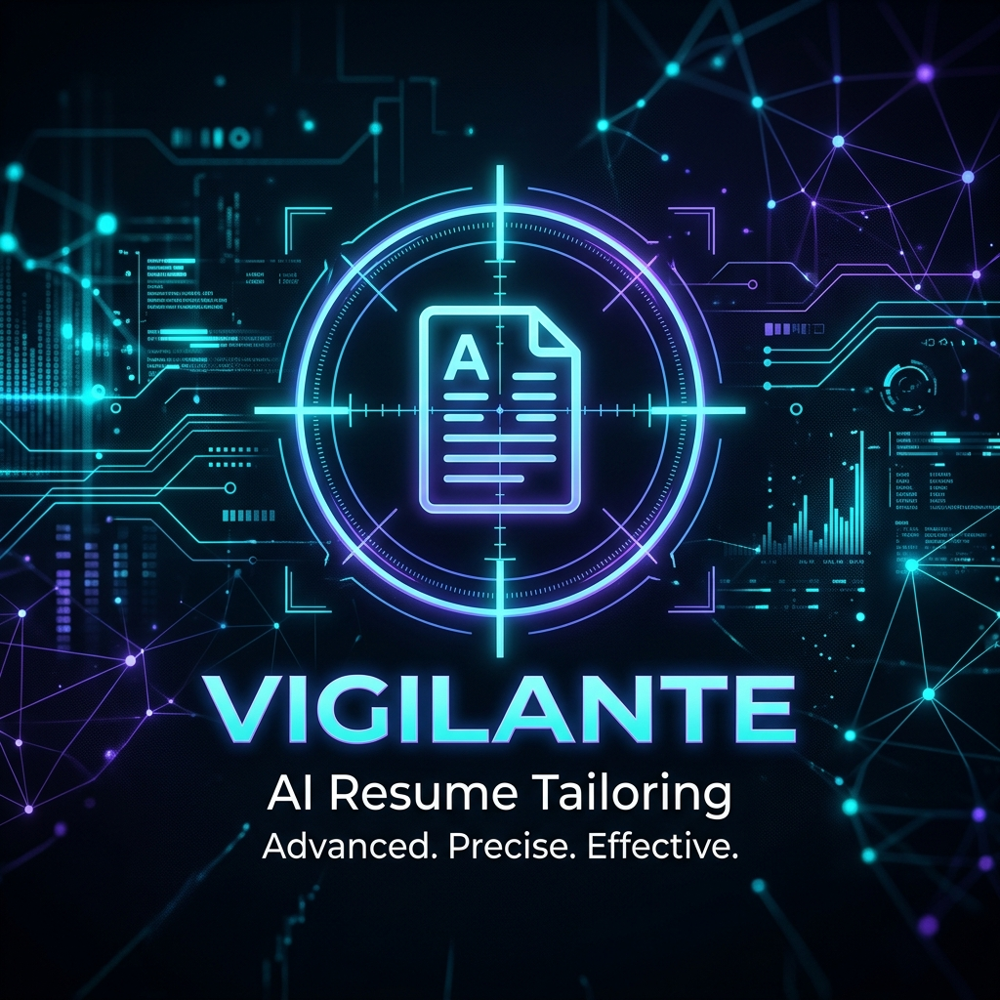
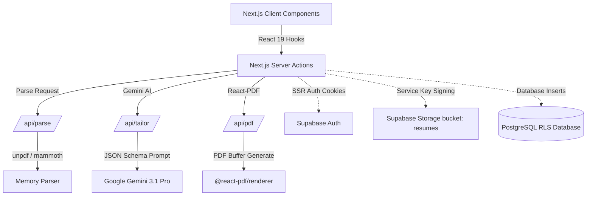

# 🎯 VIGILANTE: Advanced Resume Tailoring Engine



> **"Advanced Targeting. Lethal Optimization."**

Vigilante is a cutting-edge, enterprise-grade Next.js application designed to ruthlessly optimize unformatted resumes against targeted Applicant Tracking Systems (ATS). By leveraging state-of-the-art AI and a robust serverless architecture, Vigilante ensures your career data is presented with surgical precision.

---

## ✨ Key Features

### 🧠 Deep AI Integration
Utilizes **Google Gemini** to analyze, rewrite, and restructure resumes. It doesn't just fix typos; it re-engineers your professional narrative to match specific job descriptions.

### 🌍 Multi-Lingual PDF Engine
A sophisticated rendering system powered by `@react-pdf/renderer` and `react-pdf-html`.
- **English (LTR)**: Clean, modern professional templates.
- **Arabic (RTL)**: Full support for right-to-left scripts with perfect alignment.

### 📧 Automated Dispatch Pipeline
Once generation is complete, Vigilante automatically handles:
- Secure PDF storage in **Supabase Storage**.
- Generation of signed, time-limited download URLs.
- Instant email delivery via **Nodemailer**.

### 🛡️ Iron-Clad Security
Built on a foundation of security:
- **SSR JWT Authentication** via Supabase.
- **Row Level Security (RLS)** ensuring users only ever see their own data.
- **Upstash Ratelimiting** to prevent API abuse.

---

## 🛠️ Technology Stack

| Layer | Technology |
| :--- | :--- |
| **Framework** | [Next.js 16 (Canary/Latest)](https://nextjs.org/) |
| **Language** | [TypeScript](https://www.typescriptlang.org/) |
| **AI Orchestration** | [Google Gemini](https://deepmind.google/technologies/gemini/) |
| **Database & Auth** | [Supabase (PostgreSQL)](https://supabase.com/) |
| **Styling** | [Tailwind CSS 4](https://tailwindcss.com/) & [Framer Motion](https://www.framer.com/motion/) |
| **PDF Generation** | [@react-pdf/renderer](https://react-pdf.org/) |
| **Monitoring** | [Sentry](https://sentry.io/) & [PostHog](https://posthog.com/) |
| **Rate Limiting** | [Upstash Redis](https://upstash.com/) |

---

## 🏗️ System Architecture

Our architecture is designed for scale and security, utilizing Next.js Server Actions and a distributed API layer.



> 🔗 **Deep Dive**: See [System Architecture Detailed](diagrams/system-architecture.md)

---

## 🚀 Getting Started

### Prerequisites
- Node.js 20+
- Supabase Account
- Google AI (Gemini) API Key
- Upstash Redis Instance

### Installation

1. **Clone the repository**
   ```bash
   git clone https://github.com/Darkness947/vigilante-resume-tailor.git
   cd vigilante-resume-tailor
   ```

2. **Install Dependencies**
   ```bash
   npm install
   ```

3. **Environment Configuration**
   Copy `.env.example` to `.env.local` and fill in your credentials.
   ```bash
   cp .env.example .env.local
   ```

4. **Launch Development Server**
   ```bash
   npm run dev
   ```

---

## 📂 Project Structure

```text
├── src/
│   ├── app/            # Next.js App Router (i18n, Auth, Dashboard)
│   ├── components/     # UI Components (Shadcn, Framer Motion)
│   ├── lib/            # Core logic (AI, Supabase, PDF, Utils)
│   ├── hooks/          # Custom React hooks
│   └── styles/         # Global styles & Tailwind config
├── diagrams/           # Mermaid architecture blueprints
├── docs/               # Product requirements & walkthroughs
├── reports/            # Development phase reports
└── supabase/           # SQL migrations & seeds
```

---

## 📜 Documentation Registry

Explore our detailed engineering logs and operational guides:

### 📘 Engineering Reports (`/reports`)
- [Phase 0: Foundation & Infrastructure](reports/phase-0-report.md)
- [Phase 1: Identity & Authentication](reports/phase-1-report.md)
- [Phase 2: Visual Identity & LTR/RTL Logic](reports/phase-2-report.md)
- [Phase 3: Deep AI Parsing Workflow](reports/phase-3-report.md)
- [Phase 4: Output Compilation Engine](reports/phase-4-report.md)
- [Phase 5: Secure Application Boundaries](reports/phase-5-report.md)
- [Phase 6: Final Optimizations](reports/phase-6-report.md)

### 📖 Product Documentation (`/docs`)
- [Requirements Matrix](docs/requirements.md)
- [Operational Walkthrough](docs/walkthrough.md)
- [Final Documentation](docs/final_documentation.md)

---


All Rights Reserved. 2026 Vigilante Resume Tailor.
