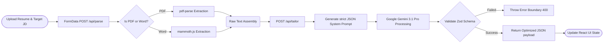

# AI Tailoring Workflow

```mermaid
graph LR
    Start([Upload Resume & Target JD]) --> A[FormData POST /api/parse]
    A --> B{Is PDF or Word?}
    B -->|PDF| C[pdf-parse Extraction]
    B -->|Word| D[mammoth.js Extraction]
    C --> E(Raw Text Assembly)
    D --> E(Raw Text Assembly)
    
    E --> F[POST /api/tailor]
    F --> G[Generate strict JSON System Prompt]
    G --> H[Google Gemini 3.1 Pro Processing]
    H --> I{Validate Zod Schema}
    
    I -->|Failed| J[Throw Error Boundary 400]
    I -->|Success| K[Return Optimized JSON payload]
    K --> End([Update React UI State])
```
