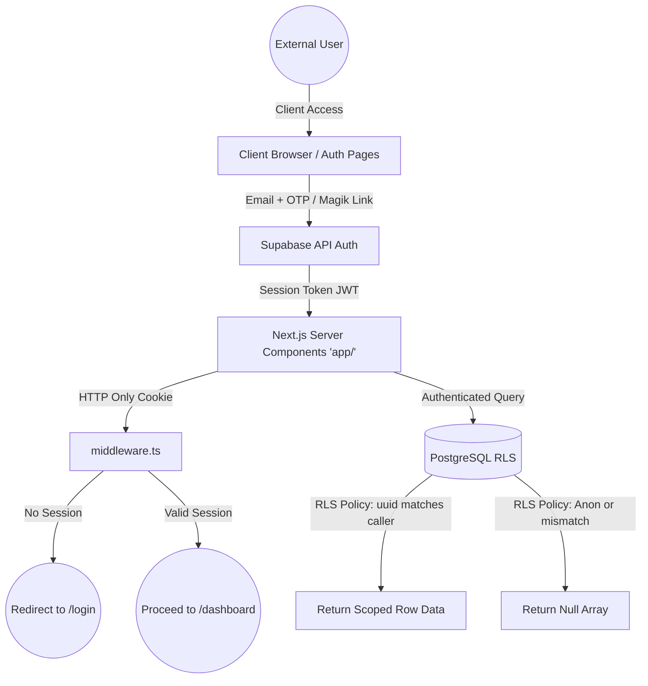

# Authentication & RLS Boundaries

```mermaid
graph TD
    User((External User)) -->|Client Access| Browser[Client Browser / Auth Pages]
    Browser -->|Email + OTP / Magik Link| Supabase[Supabase API Auth]
    
    Supabase -->|Session Token JWT| RSC[Next.js Server Components 'app/']
    
    RSC -->|HTTP Only Cookie| Middleware[middleware.ts]
    
    Middleware -->|No Session| Deny((Redirect to /login))
    Middleware -->|Valid Session| Dash((Proceed to /dashboard))
    
    RSC -->|Authenticated Query| DB[(PostgreSQL RLS)]
    
    DB -->|RLS Policy: uuid matches caller| ReturnData[Return Scoped Row Data]
    DB -->|RLS Policy: Anon or mismatch| ReturnNull[Return Null Array]
```
