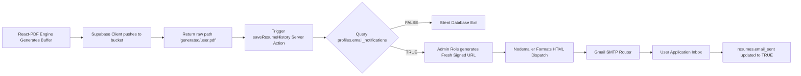

# Automated Dispatch Pipeline

```mermaid
graph LR
    A[React-PDF Engine Generates Buffer] --> B[Supabase Client pushes to bucket]
    B --> C[Return raw path 'generated/user.pdf']
    C --> D[Trigger saveResumeHistory Server Action]
    
    D --> E{Query profiles.email_notifications}
    E -->|FALSE| F[Silent Database Exit]
    E -->|TRUE| G[Admin Role generates Fresh Signed URL]
    
    G --> H[Nodemailer Formats HTML Dispatch]
    H --> I[Gmail SMTP Router]
    I --> J[User Application Inbox]
    
    J --> K[resumes.email_sent updated to TRUE]
```
