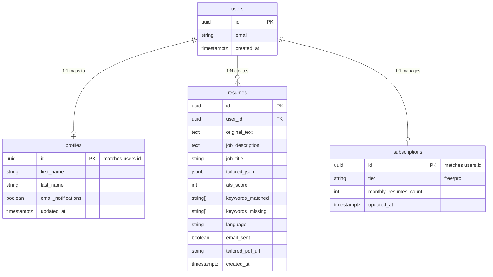

# Database Schema Map

```mermaid
erDiagram
    users ||--o| profiles : "1:1 maps to"
    users ||--o{ resumes : "1:N creates"
    users ||--o| subscriptions : "1:1 manages"

    users {
        uuid id PK
        string email
        timestamptz created_at
    }

    profiles {
        uuid id PK "matches users.id"
        string first_name
        string last_name
        boolean email_notifications
        timestamptz updated_at
    }

    resumes {
        uuid id PK
        uuid user_id FK
        text original_text
        text job_description
        string job_title
        jsonb tailored_json
        int ats_score
        string[] keywords_matched
        string[] keywords_missing
        string language
        boolean email_sent
        string tailored_pdf_url
        timestamptz created_at
    }

    subscriptions {
        uuid id PK "matches users.id"
        string tier "free/pro"
        int monthly_resumes_count
        timestamptz updated_at
    }
```
